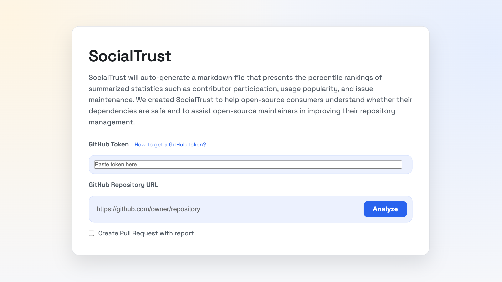

# SocialTrust




SocialTrust will auto-generate a markdown file that presents the percentile rankings of summarized statistics such as contributor participation, usage popularity, and issue maintenance.

Pipeline: scrape data (or reuse cached `data/{owner}_{repo}`), compute metrics, rank against the baseline, and write reports to `docs/` plus charts in `images/`.

## Run the web app (app.py)

```bash
# Install deps
python3 -m pip install -r requirements.txt

# Start server
python3 src/app.py
```

Then open `http://localhost:5001` and enter:
- GitHub token
- Repo URL (e.g. https://github.com/owner/repo)

Click `Analyze` to generate.

Optional: check "Create Pull Request with report" to open a PR that includes the report and images.
